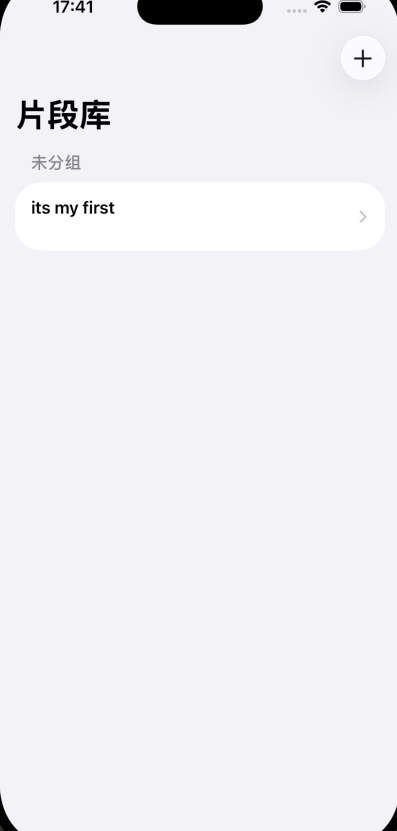
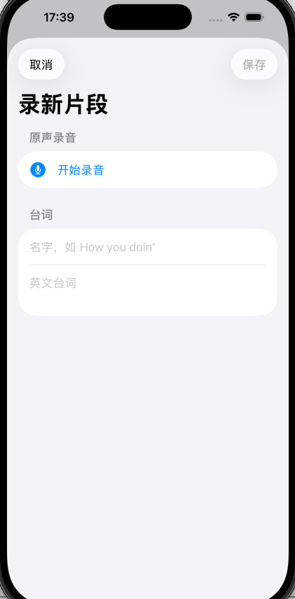
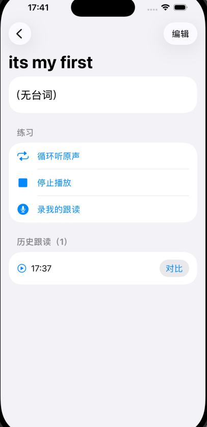

# Listen · 口语跟读

一个 iPhone 原生 app，用「录原声 → 配台词 → 反复听 → 跟读 → 对比」的方式练习英语口语。

> 理念：英语是表达性语言，日常沟通靠固定的口语格式。掌握常用句型即可应对约 80% 的日常交流。
> 这个 app 帮你从美剧/电影对话里把这些句型听进去、读出来、内化掉。

## 界面

<table>
  <tr>
    <td align="center"><b>片段库</b></td>
    <td align="center"><b>录新片段</b></td>
    <td align="center"><b>练习</b></td>
  </tr>
  <tr>
    <td></td>
    <td></td>
    <td></td>
  </tr>
</table>

## 功能

- 🎙️ **录原声** — 手机麦克风外放录下美剧/电影里的一句对话
- 📝 **配台词** — 手动输入/粘贴对应英文台词，记住句型
- 🔁 **反复听** — 循环播放原声
- 🗣️ **跟读** — 录自己的版本，**保留多次历史**，听出自己的进步
- ⇄ **对比** — 原声 → 我的版本 连续播放，靠耳朵自我对比
- 📂 编辑台词、按合集分组、滑动删除（连带清理录音文件）

纯本地单机，无账号、无联网、无第三方依赖。

## 技术栈

- **SwiftUI** 界面
- **SwiftData** 持久化（Clip / Attempt / PracticeCollection）
- **AVFoundation** 录音与播放
- **XCTest** 单元测试（逻辑层 21 个测试，音频经 `AudioService` 协议 + fake 隔离可测）
- 最低 iOS 17

## 架构

录放硬件封装在 `AudioService` 协议后（`AVAudioService` 真机实现 + `FakeAudioService` 测试替身），
所有 ViewModel（`RecordClipModel` / `PracticeModel` / `EditClipModel`）不依赖硬件、可单元测试。
录音文件存 app 沙盒 `Documents/recordings/`，数据库只存文件名。

```
Listen/
  Models/      Clip, Attempt, PracticeCollection (SwiftData)
  Audio/       AudioService 协议, AVAudioService, RecordingStore
  Features/    Library / Record / Practice (SwiftUI + ViewModels)
ListenTests/   逻辑层单元测试
docs/superpowers/  设计文档与实现计划
```

## 构建运行

用 Xcode 打开 `Listen.xcodeproj`，选 iPhone 模拟器或真机运行。
录音/播放建议在**真机**验证（模拟器麦克风不可靠）。

```bash
xcodebuild test -scheme Listen -destination 'platform=iOS Simulator,name=iPhone 17'
```

## 路线图

- [ ] 发音对比 / 评分（当前为手动对比播放）
- [ ] 合集创建与分配 UI
- [ ] 录音波形 / 语调可视化
